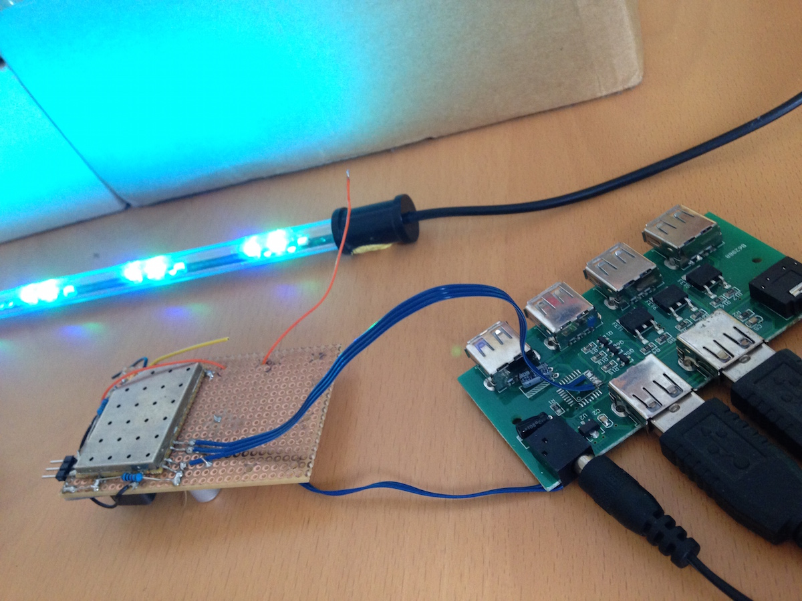

# WLED

Wireless LED bars!

I've got this set of [Revoltec LED backlight bars](http://www.amazon.de/Revoltec-Backlight-SMD-15-Entertainment-Beleuchtung/dp/B00405D7DS/ "No affiliate link."). They're meant as a form of static ambilight mounted behind a screen. The bars are normally controlled via a small IR remote control with annoying membrane keys. Finding the RGB color I want *right now* by pressing those keys endlessly for each color channel was no great joy either. Therefore I use a Carambola 2 as... well... GPIO-Wifi adapter :). This way I can even implement different color models (HSV!).

To put the C2 in control, the ATMega8 was removed from the original PCB and I soldered the C2's GPIOs to the corresponding lanes where that ATMega used to give the orders. As they're both working with 3.3V levels, everything is fine and I can even power the C2 through the original 12V power supply (and a voltage converter). The PCB now receives three PWM signals (RGB) and converts them to 12V for the bars. I'm not sure if USB connectors are a very wise choice for that. Plugging a USB stick in there will probably smell pretty funny.

Thanks to [Mathias Gottschlag](https://github.com/mgottschlag) for providing me with his C2 and lots of hardware knowledge. (I'm really more of a software guy...)

